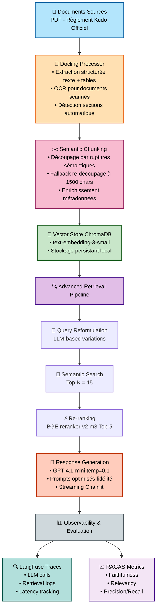

# RAG-Kudo 🥋

[](https://www.python.org/downloads/)
[](https://www.llamaindex.ai/)
[](https://openai.com/)
[](LICENSE)

Système RAG (Retrieval-Augmented Generation) avancé pour la formation des arbitres en Kudo. Utilise **LlamaIndex**, **Docling**, **RAGAS**, et **LangFuse** pour fournir des réponses précises et traçables basées sur le règlement officiel.

---

## 🎯 Objectif

Créer un assistant intelligent pour la formation des arbitres de Kudo qui :
- 📖 Répond aux questions sur les règles d'arbitrage avec **fidélité aux sources**
- 📚 Cite les sources officielles du règlement
- 🎓 Fournit des explications pédagogiques et des exemples concrets
- 📊 Mesure la qualité des réponses avec **RAGAS**
- 🔍 Traçabilité complète via **LangFuse**

---

## 🏗️ Architecture



---

## ✨ Caractéristiques Clés

### 🔬 Évaluation Quantitative (RAGAS)
- **Faithfulness**: 89.4%
- **Answer Relevancy**: 85.6%
- **Context Precision**: 79.9%
- **Context Recall**: 82.5%

Voir [EVALUATION.md](EVALUATION.md) pour les détails complets.

### 🔍 Observabilité (LangFuse)
- Traçabilité complète des appels LLM
- Monitoring de la latence et des coûts
- Débogage facilité des chaînes RAG

### 🎯 Retrieval Avancé
- **Query Reformulation**: Génération de variations de requêtes avec LLM
- **Re-ranking**: CrossEncoder pour améliorer la précision
- **Hybrid Search**: Combinaison sémantique + métadonnées

### 💬 Interface Interactive (Chainlit)
- Chat en temps réel avec streaming
- Affichage des sources et scores de pertinence
- Support multilingue (FR/EN/RU)

---

## 📊 Résultats d'Évaluation

| Métrique | Baseline | Score Actuel | Statut |
|----------|----------|-------------|--------|
| **Faithfulness** | 55.6% | **89.4%** | ✅ Excellent |
| **Answer Relevancy** | 86.3% | **85.6%** | ✅ Excellent |
| **Context Precision** | 71.8% | **79.9%** | ✅ Bon |
| **Context Recall** | 80.0% | **82.5%** | ✅ Bon |

**Optimisations réalisées :**
1. Réécriture des prompts système pour gérer le contexte multilingue (FR/EN/RU)
2. Ajout d'un fallback de re-découpage pour les chunks surdimensionnés (max 1500 chars)
3. Passage au re-ranker BAAI/bge-reranker-v2-m3
4. Calibration du seuil de similarité (0.7 → 0.3) adapté aux scores cosinus réels
5. Audit et correction des ground truths avec expertise métier

📈 [Voir l'analyse complète](EVALUATION.md)

---

## 🚀 Installation

### Prérequis

- Python 3.10+
- [uv](https://github.com/astral-sh/uv) (gestionnaire de packages rapide)
- Clé API OpenAI (ou Anthropic)
- GPU recommandé pour re-ranking (optionnel)

### Installation Rapide

```bash
# Cloner le repository
git clone https://github.com/dlakisic/RAG-Kudo.git
cd RAG-Kudo

# Installer avec uv
uv sync

# Configuration
cp .env.example .env
# Éditer .env et ajouter votre OPENAI_API_KEY
```

### Configuration

Éditer `.env` :

```bash
# LLM
OPENAI_API_KEY=sk-...
LLM_MODEL=gpt-4.1-mini
LLM_TEMPERATURE=0.1

# Embeddings
EMBEDDING_MODEL=text-embedding-3-small

# Retrieval
TOP_K=5
SIMILARITY_THRESHOLD=0.3
USE_RERANKING=true
RERANKER_MODEL=BAAI/bge-reranker-v2-m3

# LangFuse (optionnel)
LANGFUSE_ENABLED=true
LANGFUSE_PUBLIC_KEY=pk-...
LANGFUSE_SECRET_KEY=sk-...
```

---

## 📚 Utilisation

### 1. Pipeline Complet (Ingestion → Indexation → Interface)

```bash
# Placer vos documents PDF dans data/raw/
cp /path/to/reglement_kudo.pdf data/raw/

# Lancer le pipeline
uv run python scripts/pipeline.py full

# Ou étape par étape:
uv run python scripts/pipeline.py ingest  # Extraction avec Docling
uv run python scripts/pipeline.py index   # Indexation vectorielle
uv run python scripts/pipeline.py query "Quelle est la valeur d'un ippon ?"
```

### 2. Interface Web (Chainlit)

```bash
# Lancer l'interface
chainlit run app/chainlit_app.py -w

# Accéder à http://localhost:8000
```

**Fonctionnalités de l'interface:**
- 💬 Chat en temps réel avec streaming
- 📚 Affichage des sources dans la sidebar
- 📊 Scores de confiance et de pertinence
- 🌍 Support FR/EN/RU

### 3. Évaluation RAGAS

```bash
# Évaluer le système sur 10 questions
uv run python scripts/run_evaluation.py

# Analyser les résultats
uv run python scripts/analyze_results.py

# Résultats dans: data/evaluation/results.csv
```

### 4. Utilisation Programmatique

```python
from src.retrieval import VectorStoreManager
from src.generation import KudoResponseGenerator

# Charger l'index
manager = VectorStoreManager()
index = manager.load_index()

# Générer une réponse
generator = KudoResponseGenerator(index=index)
result = generator.generate("Quelles sont les techniques de frappe autorisées ?")

print(result["answer"])
print(f"Confiance: {result['confidence']:.1%}")
print(f"Sources: {result['num_sources']}")
```

---

## 📁 Structure du Projet

```
RAG-Kudo/
├── data/
│   ├── raw/                 # Documents sources (PDF)
│   ├── processed/           # Documents traités (Docling)
│   ├── vectorstore/         # ChromaDB
│   └── evaluation/          # Résultats RAGAS
├── src/
│   ├── ingestion/           # Docling processor + chunking
│   ├── retrieval/           # Vector store + retriever + re-ranker
│   ├── generation/          # LLM manager + response generator
│   ├── evaluation/          # RAGAS evaluator
│   ├── observability/       # LangFuse integration
│   └── utils/               # Helpers (GPU utils, etc.)
├── app/
│   └── chainlit_app.py      # Interface web Chainlit
├── scripts/
│   ├── pipeline.py          # Pipeline CLI principal
│   ├── run_evaluation.py    # Évaluation RAGAS
│   └── analyze_results.py   # Analyse des résultats
├── config/
│   └── settings.py          # Configuration Pydantic
├── EVALUATION.md            # 📊 Rapport d'évaluation détaillé
├── FEATURES.md              # Liste des fonctionnalités
├── QUICKSTART.md            # Guide de démarrage rapide
└── README.md                # Ce fichier
```

---

## 🔧 Composants Techniques

### Ingestion (Docling)
- Extraction structurée de PDFs (texte + tables)
- OCR pour documents scannés
- Détection automatique de sections et métadonnées

### Retrieval Pipeline
1. **Query Reformulation**: LLM génère des variations de la question
2. **Semantic Search**: Embeddings + similarité cosinus + RRF fusion
3. **Re-ranking**: BAAI/bge-reranker-v2-m3 affine les résultats (Top-5)

### Generation
- **GPT-4.1-mini** avec prompts optimisés pour fidélité aux sources multilingues
- **Temperature 0.1** pour réponses quasi-déterministes
- **Citations explicites** du règlement

### Observabilité
- **LangFuse**: Traces LLM, latence, coûts
- **RAGAS**: Évaluation quantitative (4 métriques)
- **Logs structurés** avec Loguru

---

## 📊 Métriques & Performances

### Latence (sur GPU T4)
- Ingestion: ~2-3s par page PDF
- Retrieval: ~300-500ms
- Generation: ~2-4s (streaming)
- **Total**: ~3-5s par requête

### Coûts (estimation)
- Embeddings: ~$0.0001 par chunk
- LLM (GPT-4.1-mini): ~$0.005-0.015 par requête
- RAGAS évaluation: ~$0.50-1.00 pour 10 questions

---

## 🎯 Cas d'Usage

### 1. Formation d'Arbitres
- Questions/réponses sur les règles
- Explications pédagogiques avec exemples
- Citations exactes du règlement officiel

### 2. Vérification de Décisions
```python
result = generator.explain_decision(
    situation="Combattant frappe après l'arrêt",
    decision="Avertissement donné"
)
```

### 3. Génération de Quiz
```python
quiz = generator.generate_quiz_question(category="scoring")
```

---

## 🔬 Challenges & Solutions

| Challenge | Solution Implémentée |
|-----------|---------------------|
| **Faithfulness faible (55.6% → 89.4%)** | Réécriture des prompts + gestion multilingue + audit ground truths |
| **Chunks surdimensionnés** | Fallback de re-découpage à 1500 chars sur frontières naturelles |
| **Multilingue (FR/EN/RU)** | Prompts multilingues + extraction cross-langue |
| **Précision retrieval** | Re-ranking BGE + RRF fusion + calibration seuil similarité |
| **Traçabilité** | LangFuse pour observabilité complète |

---

## 🤝 Contribution

Les contributions sont bienvenues ! Pour contribuer :

1. Fork le projet
2. Créer une branche (`git checkout -b feature/amazing-feature`)
3. Commit (`git commit -m 'Add amazing feature'`)
4. Push (`git push origin feature/amazing-feature`)
5. Ouvrir une Pull Request
